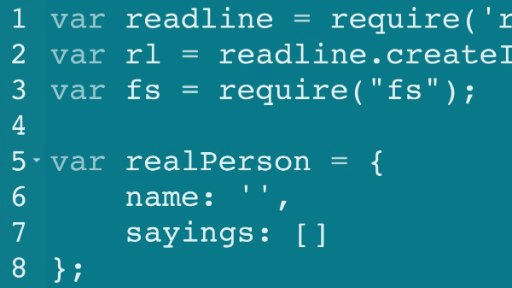
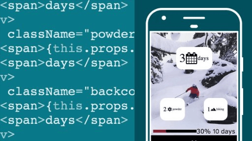
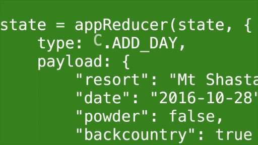
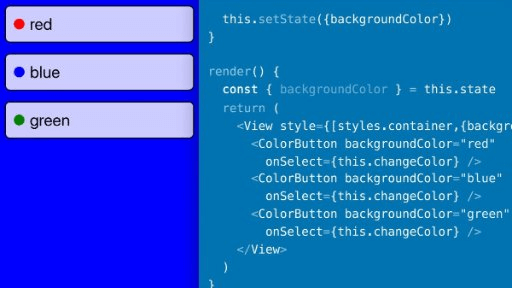
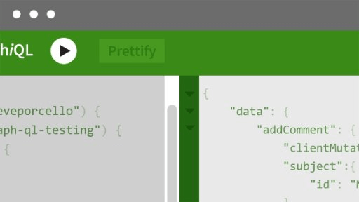
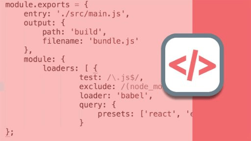

About Moon Highway
======

Moon Highway is a training and curriculum development company based in Tahoe City, California. Our goal in every course is to deliver hands-on, immediately relatable content for engineering teams.

## Who We Train
We teach engineering teams how to build powerful applications with the latest technologies.

Whether it’s a project manager who needs to know more about HTML, a front-end engineer who needs to know the latest JavaScript, or a back-end developer who is ready to finally fall in love with JavaScript, we’ll deliver an engaging course that meets everyone’s needs.

## Who We Are

@bio@

### Alex Banks
[Twitter](https://twitter.com/moontahoe)
[Github](https://github.com/moontahoe)
[LinkedIn](https://www.linkedin.com/in/alexbanks/)
Alex Banks is a software engineer, instructor, and co-founder of Moon Highway. As a software consultant, he has developed applications for the Chicago Marathon, MSN, and the Department of Energy. In addition, he's authored several classes for Lynda.com/LinkedIn Learning.
* [Alex's Classes on LinkedIn Learning](https://www.linkedin.com/learning/instructors/alex-banks)
@endbio@

@bio@

### Eve Porcello
[Twitter](https://twitter.com/eveporcello)
[Github](https://github.com/eveporcello)
[LinkedIn](https://www.linkedin.com/in/eveporcello/)
Eve Porcello is a software architect, instructor, and co-founder of Moon Highway. Prior to Moon Highway, Eve worked on software projects for 1-800-Dentist and Microsoft. She is an active corporate trainer, speaker, and author on Lynda.com/LinkedIn Learning.
* [Eve's Classes on LinkedIn Learning](https://www.linkedin.com/learning/instructors/eve-porcello)
@endbio@

## Why Our Classes are Different

### Quality Content
We create and maintain all of our own content. With our Github repositories, all of our samples, exercises, and labs are open-source projects where we make changes as technologies evolve.

### Expert Knowledge
Our trainers are our curriculum developers, so they have first-hand knowledge of all of the course contents. They also dig deep into the languages and libraries that they teach to understand the features and avoid the problems. We don’t teach every technology - we focus on the ones that we know out and out.

### Collaborative Approach
We care a lot about helping our students succeed. An instructor is not just a technology expert who covers the bullet points and hopes people can keep up. An instructor should facilitate a collaborative effort. We listen to the needs of the students in real-time to make students feel engaged and supported when learning something new.

## Curriculum Development
Over two decades of teaching programming courses, we've developed a standard approach to courseware that focuses more on hands-on training and less on lecture.

Our course materials contain several different components: samples, topics, exercises, and labs.

@right@
### Samples
Samples are short code examples that introduce a new concept.

@endright@

@left@
### Topics
Several samples together comprise a topic, a content area that is covered throughout the day.

@endleft@

@right@
### Exercises
Samples are short code examples that introduce a new concept.

@endright@

@left@
### Labs
are where we challenge students to see what they have retained. Usually starting from a list of requirements, the students work on these tiny projects independently or with pair programming. This allows students to work hands-on to solve a problem that they might face in their day to day work.

@endleft@

## Student Testimonials

>I like that this was hands-on and less lecture/presentation-based.
* Node.js Kickoff student

<!-- -->
>No student left behind - very cool.
* JavaScript Pro student

<!-- -->
>Great job of both answering questions & keeping the pace moving in class!
* JavaScript Kickoff student

<!-- -->
>Instructor is very good. Knowledgeable and a good communicator. Pace of class was great as well as the materials. Fast enough to challenge but not to frustrate.
* CSS Pro student

<!-- -->
>Very knowledgeable, able to discuss any side topic or deeper concept, engaging, built excellent connection to class. Good pacing."
* HTML Foundation student

<!-- -->
>Instructor is good about redirecting lessons on the fly based on questions and input.
* JavaScript Kickoff student

## LinkedIn Learning Classes
Since 2015, we’ve created several classes as LinkedIn Learning authors. Our courses can be used as prerequisites or supplemental materials to our course offerings.

### Courses We’ve Recorded

@video-https://www.linkedin.com/learning/node-js-essential-training@

### Node.js Essential Training
By: Alex Banks
Length: 6 hours 16 minutes
@endvideo@

@video-https://www.linkedin.com/learning/learning-react-js-2@

### Learning React
By: Eve Porcello
Length: 1 hour 41 minutes
@endvideo@

@video-https://www.linkedin.com/learning/react-js-essential-training@

### React Essential Training
By: Eve Porcello
Length: 3 hours
@endvideo@

@video-https://www.linkedin.com/learning/learning-redux@

### Learning Redux
By: Alex Banks
Length: 2 hours 59 minutes
@endvideo@

@video-https://www.linkedin.com/learning/learning-react-native-2@

### Learning React Native
By: Alex Banks
Length: 2 hours 59 minutes
@endvideo@

@video-https://www.linkedin.com/learning/learning-ecmascript-6@

### Learning ECMAScript 6
By: Eve Porcello
Length: 1 hour 18 minutes
@endvideo@

@video-https://www.linkedin.com/learning/learning-graphql@

### Learning GraphQL
By: Eve Porcello
Length: 53 minutes
@endvideo@

@video-https://www.linkedin.com/learning/learn-webpack-the-basics@

### Learn Webpack: The Basics
By: Eve Porcello
Length: 1 hour 1 minute
@endvideo@

