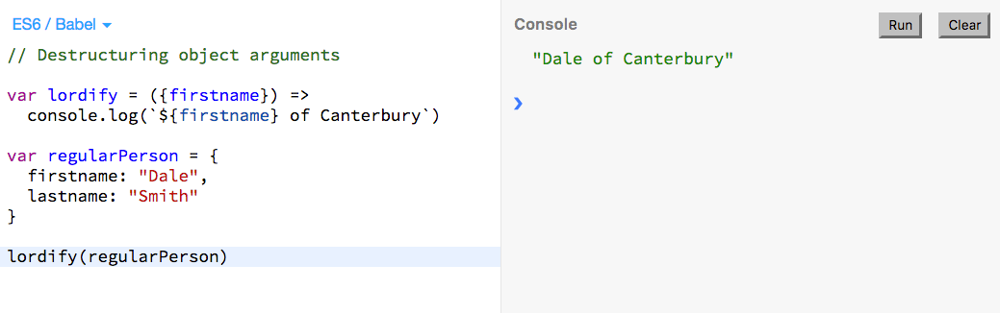
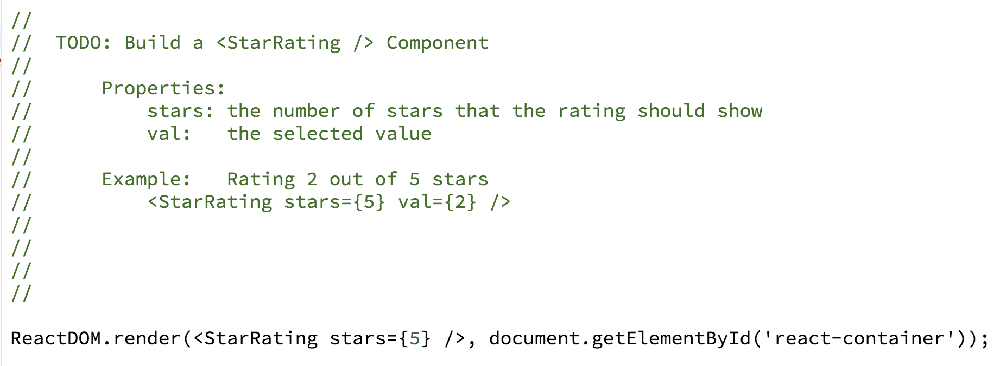

About Moon Highway
======

Moon Highway is a training and curriculum development company based in Tahoe City, California. Our goal in every course is to deliver hands-on, immediately relatable content for engineering teams.

## Who We Train
We teach engineering teams how to build with the latest technologies.

Whether it’s a project manager who needs to know more about HTML, a front-end engineer who needs to know the latest JavaScript, or a back-end developer who is ready to finally fall in love with JavaScript, we’ll deliver an engaging course that meets everyone’s needs.

## Bios

### Alex Banks  
Alex Banks is a software engineer, instructor, and co-founder of Moon Highway, a curriculum development company in Northern California. As a software consultant, he has developed applications for the Chicago Marathon, MSN, and the Department of Energy. In addition, he's authored several classes for Lynda.com.

* [Alex's Classes on LinkedIn Learning](#)

### Eve Porcello  
Eve Porcello is a software architect and co-founder of Moon Highway, a curriculum development company in Northern California. Prior to Moon Highway, Eve worked on software projects for 1-800-Dentist and Microsoft. She is an active corporate trainer, speaker, and author on Lynda.com.

* [Eve's Classes on LinkedIn Learning](#)

## Why Our Classes are Different

### Quality Content
We create and maintain all of our own content. With our Github repositories, all of our samples, exercises, and labs are open-source projects where we make changes as technologies evolve.

### Expert Knowledge
Our trainers are our curriculum developers, so they have first-hand knowledge of all of the course contents. They also dig deep into the languages and libraries that they teach to understand the features and avoid the problems. We don’t teach every technology - we focus on the ones that we know out and out.

### Empathy
We care a lot about helping our students succeed. An instructor is not just a technology expert who covers the bullet points and hopes people can keep up. An instructor should facilitate a collaborative effort. We listen to the needs of the students in real-time to make students feel engaged and supported when learning something new.

### Not Just White Dudes
Unlike most training companies, we don’t just pull young white dudes off of Craigslist, put them in a button down shirt, and send them to your office. We are a diverse team, and we think that’s good.

## Course Content
Moon Highway courses are designed to be engaging and hands-on. We might use a few slides here and there, but we aim to get students typing code, rather than listening to lecture.

Our course materials are comprised of three different components: samples, exercises, and labs.

* _Samples_ are short code blocks that introduce a new concept.

* _Exercises_ are longer activities that build on what has been learned in samples. Exercises have iterations where we take students through the process of creating something step by step.

* _Labs_ are where we challenge students to see what they have retained. Usually starting from a list of requirements, the students work on these tiny projects independently or with pair programming. This allows students to work hands-on to solve a problem that they might face in their day to day work.

## Student Testimonials

"I like that this was hands-on and less lecture/presentation based" - Node.js Kickoff student
"No student left behind - very cool." - JavaScript Pro student
"Great job of both answering questions & keeping the pace moving in class!" - JavaScript Kickoff student
"Instructor is very good. Knowledgeable and a good communicator. Pace of class was great as well as the materials. Fast enough to challenge but not to frustrate." - CSS Pro student
"Very knowledgeable, able to discuss any side topic or deeper concept, engaging, built excellent connection to class. Good pacing." - HTML Foundation student
"Instructor is good about redirecting lessons on the fly based on questions and input." - JavaScript Kickoff student

## LinkedIn Learning Classes
Since 2015, we’ve created several classes as LinkedIn Learning authors. Our courses can be used as prerequisites or supplemental materials to our course offerings.

### Courses We’ve Recorded
* [Node.js Essential Training]()
* [Learning React]()
* [React.js Essential Training]()
* [Learning ECMAScript 6]()
* [Learning GraphQL]()
* [Learning React Native]()
* [Learning Redux]()
